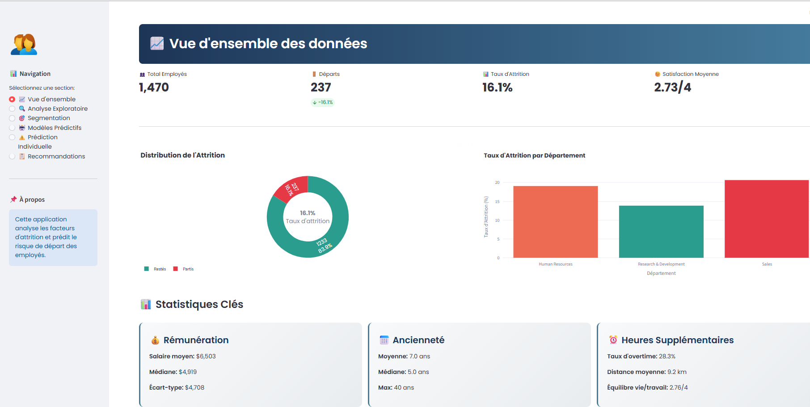
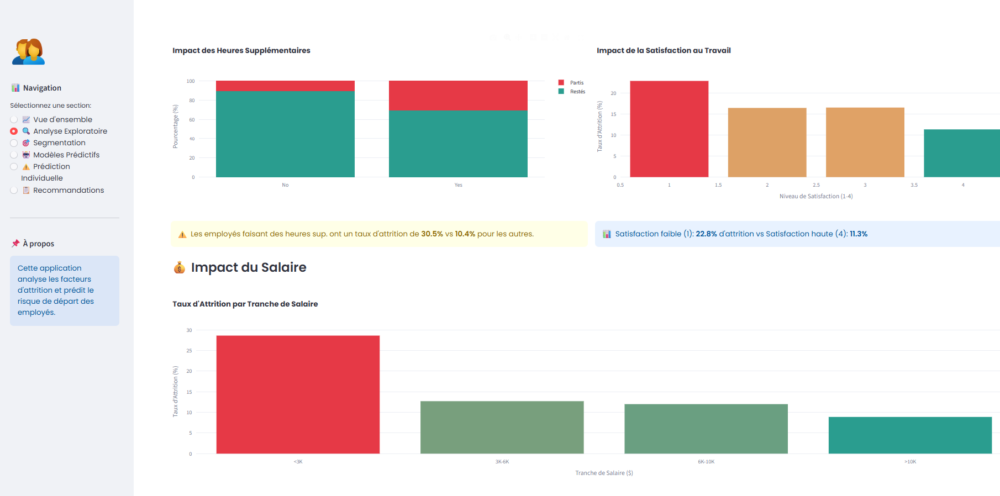
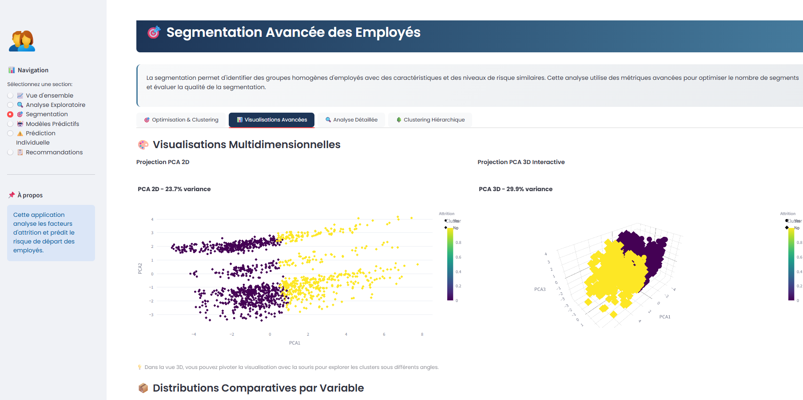
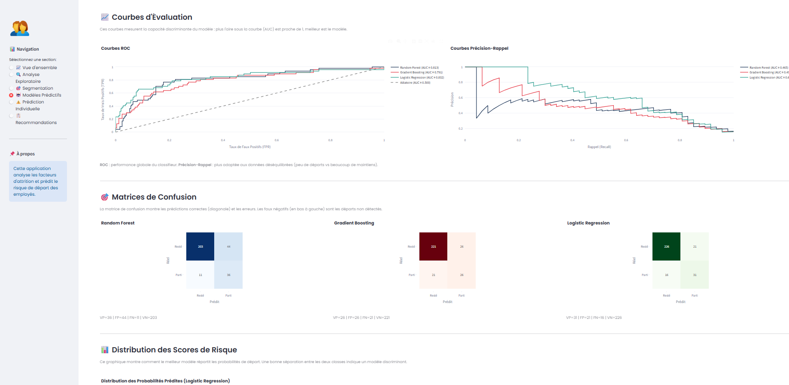

<div align="center">

# 👥 Analyse de l'Attrition des Employés

**Un tableau de bord Streamlit complet pour la prédiction, la segmentation et la prévention du turnover RH**

[](https://www.python.org/)
[](https://streamlit.io)
[](https://scikit-learn.org)
[](LICENSE)



</div>

---

## 📖 Présentation

Ce tableau de bord offre une analyse complète de l'attrition RH à partir du [jeu de données IBM HR Analytics](https://www.kaggle.com/datasets/pavansubhasht/ibm-hr-analytics-attrition-dataset) (1 470 employés, 35 variables).

Il répond à trois questions essentielles pour les équipes RH :

| Question                                                                      | Module                                       |
| ----------------------------------------------------------------------------- | -------------------------------------------- |
| **Qui est à risque ?** — Comprendre les facteurs qui poussent au départ       | Analyse Exploratoire                         |
| **Quels profils d'employés existent ?** — Identifier des groupes homogènes    | Segmentation                                 |
| **Que va-t-il se passer ?** — Prédire la probabilité d'attrition individuelle | Modèles Prédictifs & Prédiction Individuelle |

---

## ✨ Fonctionnalités

| Page                           | Description                                                                                                                                                 |
| ------------------------------ | ----------------------------------------------------------------------------------------------------------------------------------------------------------- |
| 📈 **Vue d'ensemble**          | KPIs clés, distribution de l'attrition, analyse par département                                                                                             |
| 🔍 **Analyse Exploratoire**    | Facteurs de risque, distributions, heatmap de corrélations                                                                                                  |
| 🎯 **Segmentation Avancée**    | K-Means & Clustering Hiérarchique, métriques Elbow / Silhouette / Davies-Bouldin, projections PCA 2D/3D, dendrogramme interactif                            |
| 🤖 **Modèles Prédictifs**      | Random Forest, Gradient Boosting, Régression Logistique ; SMOTE ; seuils F1-optimaux ; courbes ROC & PR ; matrices de confusion ; validation croisée 5-fold |
| ⚠️ **Prédiction Individuelle** | Scoring de risque en temps réel à partir d'un profil saisi manuellement, avec recommandations personnalisées                                                |
| 📋 **Recommandations**         | Plan d'action priorisé (urgences → long terme), ROI estimé, export CSV des employés à risque                                                                |

---

## 🖼️ Captures d'écran

### Vue d'ensemble & KPIs


### Analyse Exploratoire



### Segmentation — Projection PCA



### Modèles Prédictifs — Comparaison & Courbes ROC



### Prédiction Individuelle


> 📸 Pour ajouter vos captures : placez les images dans `docs/images/` en respectant les noms ci-dessus.

---

## 🚀 Démarrage Rapide

### 1. Cloner le dépôt

```bash
git clone https://github.com/<votre-username>/employee-attrition-analytics.git
cd employee-attrition-analytics
```

### 2. Créer et activer un environnement virtuel

```bash
python -m venv .venv
# Windows
.venv\Scripts\activate
# macOS / Linux
source .venv/bin/activate
```

### 3. Installer les dépendances

```bash
pip install -r requirements.txt
```

### 4. Lancer l'application

```bash
streamlit run app/app.py
```

Le tableau de bord s'ouvre automatiquement sur `http://localhost:8501`.

---

## 📁 Structure du Projet

```
employee-attrition-analytics/
│
├── app/
│   └── app.py              # Point d'entrée Streamlit & routage des pages
├── requirements.txt        # Dépendances Python
├── .gitignore
├── README.md
│
├── data/
│   └── WA_Fn-UseC_-HR-Employee-Attrition.csv   # Jeu de données IBM HR
│
├── src/
│   ├── config.py           # CSS personnalisé, palette de couleurs, constantes ML
│   │
│   ├── data/
│   │   └── loader.py       # load_data(), preprocess_data()
│   │
│   ├── features/
│   │   └── engineering.py  # create_feature_matrix()
│   │
│   ├── models/
│   │   ├── classifier.py   # train_models() — RF / GBM / LR + SMOTE
│   │   └── clustering.py   # find_optimal_clusters(), perform_clustering(),
│   │                       # perform_hierarchical_clustering()
│   │
│   └── views/
│       ├── overview.py         # Vue d'ensemble
│       ├── exploratory.py      # Analyse exploratoire
│       ├── segmentation.py     # Segmentation avancée
│       ├── predictive.py       # Modèles prédictifs
│       ├── individual.py       # Prédiction individuelle
│       └── recommendations.py  # Recommandations stratégiques
│
└── docs/
    ├── images/                 # Captures d'écran du dashboard
    └── project_structure.md
```

---

## 🧰 Stack Technique

| Couche                    | Bibliothèque                                                      |
| ------------------------- | ----------------------------------------------------------------- |
| Interface / App           | [Streamlit](https://streamlit.io)                                 |
| Données                   | [Pandas](https://pandas.pydata.org/), [NumPy](https://numpy.org/) |
| Visualisation             | [Plotly](https://plotly.com/python/)                              |
| Machine Learning          | [scikit-learn](https://scikit-learn.org/)                         |
| Rééquilibrage des classes | [imbalanced-learn](https://imbalanced-learn.org/) (SMOTE)         |
| Statistiques              | [SciPy](https://scipy.org/)                                       |

---

## 🤖 Méthodologie ML

```
Données brutes (1 470 lignes)
        │
        ▼
Feature Engineering  ──  35 variables brutes + 8 dérivées  ──  43 au total
        │
        ▼
Découpage stratifié 80/20  (entraînement / test)
        │
        ▼
StandardScaler  →  SMOTE (entraînement uniquement, ratio 0.7)
        │
        ├── Random Forest        (n=500, balanced_subsample)
        ├── Gradient Boosting    (n=500, lr=0.03)
        └── Régression Logistique (L1, C=0.05, saga)
                │
                ▼
        Seuil de décision optimal par F1-Score
                │
                ▼
        Évaluation : Accuracy · Précision · Recall · F1 · AUC-ROC
```

> **Point clé :** Le **Recall** est la métrique prioritaire — rater un vrai départ coûte plus cher que générer une fausse alerte.

---

## 📊 Jeu de Données

| Attribut  | Valeur                                                                                     |
| --------- | ------------------------------------------------------------------------------------------ |
| Source    | IBM HR Analytics Employee Attrition & Performance                                          |
| Lignes    | 1 470 employés                                                                             |
| Variables | 35 (numériques + catégorielles)                                                            |
| Cible     | `Attrition` (Yes / No) — ~16 % de classe positive                                          |
| Accès     | [Kaggle](https://www.kaggle.com/datasets/pavansubhasht/ibm-hr-analytics-attrition-dataset) |

---

## 🔑 Variables Clés

Les variables les plus impactantes identifiées par les trois modèles :

| Variable                 | Type         | Impact                                    |
| ------------------------ | ------------ | ----------------------------------------- |
| `OverTime`               | Catégorielle | 🔴 Facteur prédictif n°1                  |
| `MonthlyIncome`          | Numérique    | 🔴 Salaires bas → forte attrition         |
| `Age` + `YearsAtCompany` | Numérique    | 🟡 Jeunes employés récents très volatils  |
| `JobSatisfaction`        | Ordinale     | 🟡 Signal d'alerte précoce                |
| `StockOptionLevel`       | Ordinale     | 🟡 Absence = faible engagement long terme |
| `WorkLifeBalance`        | Ordinale     | 🟡 Corrélé aux heures supplémentaires     |

---

## 📝 Licence

Distribué sous licence [MIT](LICENSE).

---

## 🙏 Remerciements

- IBM pour la mise à disposition du jeu de données HR Analytics
- Les communautés open-source Streamlit et scikit-learn
